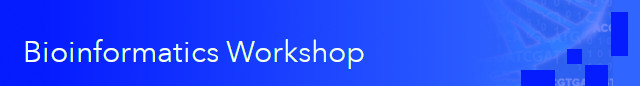

Welcome to the Fall 2025 and Spring 2026 Bioinformatics (BFX) Workshop! It can be taken for credit under the WUSTL course titles: Applied Bioinformatics for Genomics I and II.

## Objectives

This workshop series is designed for people who want to:

- learn the fundamentals of computational genomics
- use this information to improve and expedite their research
- expand their knowledge by hearing from experts in other subject areas

By the end of this series, participants will be able to:

- Demonstrate basic competency in running key bioinformatics software
- Analyze sequencing data, going from raw data to biologically interpretable results
- Draw upon a diverse set of genomic technologies to answer specific research questions
- Apply critical thinking and analytic competencies to genomics research

## Registration

Register for the 2025-2026 Workshop [here](https://redcap.link/BFX2025)!

After registering, you'll be added to an email distribution list and slack channel for the course. See the [Communications](README.md#Communications) section below for details. There is no obligation to complete the course if you register, but it helps us with planning and securing appropriate resources.

**You can join the course at any time!**  All of the lessons and lectures are archived, so you are welcome to "catch-up" on your own - we're happy to help talk you through homework questions, even if they're from a month ago!

## Schedule

Weekly workshops are held on Mondays @ 10am in [Mid-Campus Center](https://maps.google.com/?q=4590%20Children) (MCC) 11th floor Main Conference Room (Room #11504)

The BFX Workshop schedule, __subject to change__, is available below. Previous years' course materials can still be accessed in the [archive](archive) folder. We *strongly* encourage in-person participation, but a Zoom recording of each Workshop session will also be made available shortly after each session. See [Participation](README.md#Participation) for more details about external or remote participation.

Time will be set aside 30 minutes before and after each lecture for "office hours", where you can get help with assignments, or ask for advice about your own projects.

### Fall 2025

| Date    | Time     | Topic                                            | Presenter       |
|---------|----------|--------------------------------------------------|-----------------|
| 8/25/25 | 10:00am  | [Intro to Bioinformatics and Computer Setup](lectures/week_01/)       | Chris Miller    |
|         | 11:00am  | Extra help with setup                            |                 |
| 9/1/25  |          | NO CLASS – Labor Day                             |                 |
| 9/8/25  | 9:00am   | Extra help with setup                            |                 |
|         | 10:00am  | [Introduction to Unix and the command line](lectures/week_02)        | Chris Miller    |
|         | 11:00am  | Extra help with setup                            |                 |
| 9/15/25 | 10:00am  | [Sequence data generation/manipulation](lectures/week_03)            | Chris Miller    |
| 9/22/25 | 10:00am  | [DNA Alignment Fundamentals](lectures/week_04)                       | Chris Miller             |
| 9/29/25 | 10:00am  | [Sequence data visualization/IGV](lectures/week_05)                  | Chris Miller    |
| 10/6/25 |          | NO CLASS – Fall Break                            |                 |
| 10/13/25| 10:00am  | Data manipulation and basic plotting with R      | Chris Miller    |
| 10/20/25| 10:00am  | RNA sequencing I – Data and Alignment            | TBD             |
| 10/27/25| 10:00am  | RNA sequencing II – Transcript Quantification    | TBD             |
| 11/3/25 | 10:00am  | RNA sequencing III – Differential Expression     | TBD             |
| 11/10/25|          | NO CLASS                                         |                 |
| 11/17/25| 10:00am  | Germline and Somatic Variant Calling             | Chris Miller    |
| 11/24/25| 10:00am  | Parsing, Filtering, and Annotating VCFs          | John Garza      |
| 12/1/25 | 10:00am  | Troubleshooting Bioinformatics, semester wrap‑up | Chris Miller    |

**If you missed the first week, it's fine! Join us on Sept 8th - there's plenty of time to catch up!**

### Spring 2026

Dates and presenters TBD

Topics will include:
- Genomic Intervals and Bedtools
- Epigenomics, ChIP/ATAC/WGBS
- Data visualization with R
- Genome Assembly, Pangenome
- Single-cell RNAseq
- Genomic Workflows/Cloud Computing
- Microbial Genomics
- Machine Learning/AI in Genomics
- Long Read Sequencing

## Participation

There are no requirements or qualifications to participate in the BFX Workshop. However, this course ramps up quickly and you will need to have basic competency at the unix command line within the first three weeks. We will cover some of these skills in the first two weeks of class, but if you are new to working at a terminal, we **strongly recommend** that you block out some substantial time to work through the command-line exercises in the first two week's assignments.

If you are not taking the course for credit, there are no attendance requirements. There will be "assignments" given during most lectures and we strongly encourage you to complete them in order to get the most out of the course - lectures are no substitute for hands-on learning!

For external or remote asyncronous participation, we suggest watching each weekly Zoom recording (available shortly after each in-person session) and strongly encourage interaction via [Slack](README.md#Slack). The #bfx_workshop Slack channel is the primary form of interaction between workshop attendees, external participants, organizers, and presenters. 

## Organizers

This workshop is a collaborative effort between the Institute for Clinical and Translational Sciences (ICTS), the Department of Medicine, McDonnell Genome Institute (MGI), the Division of Hematology & Oncology, and the Department of Pediatrics with faculty, staff, and student representation and participation from many other Institutes, Departments, and Divisions at Washington University School of Medicine in St. Louis.

The course director is [Chris Miller](https://oncology.wustl.edu/people/christopher-a-miller-phd/) (c.a.miller@wustl dot edu) and John Garza (johnegarza@wustl dot edu) is our dedicated teaching assistant.

Folks giving lectures in this workshop have multi-disciplinary backgrounds in Bioinformatics, Medicine, Computational Biology, Genetics, Computer Science, Oncology, Virology, Information Systems, Microbiology, Immunology, and many other combinations of both Data and Biological Sciences. They share best practices, technology, and knowledge from decades of experience working in these fields of study. Each year, the course evolves to match the rapidly evolving landscape of tools and techniques. 

The organizers would like to specifically thank the [ICTS Precision Health](https://icts-precisionhealth.wustl.edu/) function for supporting the Bioinformatics Workshop. (NIH CTSA Grant Number UL1TR002345)

## Communications

### Slack

Announcements, discussion, and homework help all take place primarily via Slack. For members of the ICTS Precision Health Slack organization [ictsprecisionhealth.slack.com](http://ictsprecisionhealth.slack.com), please use the [#bfx-workshop](https://ictsprecisionhealth.slack.com/archives/C040Q704WS2) channel. If you do not have access to the ICTS Precision Health Slack, please email [johnegarza at wustl.edu]

### Email

An Office 365 email group will be created for general announcements, schedule changes, etc from those that [register](README.md#Registration).  

### Archived Lectures

If you'd like to look back at past sessions, course info and lectures from previous academic years are available in the archives:

- [2020-2021](archive/v2020-2021)
- [2021-2022](archive/v2021-2022) 
- [2022-2023](archive/v2022-2023)
- [2023-2024](archive/v2023-2024)
- [2024-2025](archive/v2024-2025)

Banner image adapted from [NHGRI](https://www.flickr.com/photos/genomegov/27862777945) (public domain)
